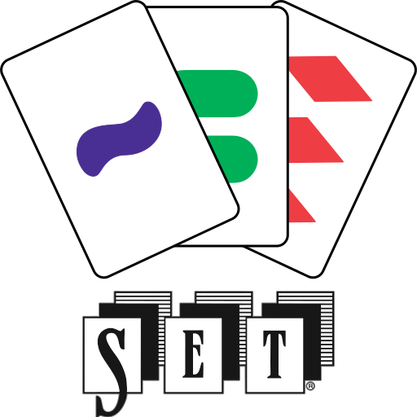

# Welcome to **Set Online**

## Development server

- 📋 Copy `.env.example` and rename it to `.env` executing `cp .env.example .env`

1. With DevContainer

- 📋 Generate Dev Containers docker-compose with `cp .devcontainer/docker-compose.yml.example .devcontainer/docker-compose.yml`
- 📝 Edit build arg with the result of the following command `echo 'USER_GID:' $(id -g) && echo 'USER_UID:' $(id -u)`
- 🐋 Run VSCode Dev Container command `Reopen in Container`

You can also view node execution logs by running `docker logs set-nx -f -n 100` in a host terminal.

2. In your machine

- ⚙️ Run `docker compose up -d` and wait for it to finish (be patient)
- 📦 Install dependencies executing command `npm`
- 🛠️ Install extensions listed by running `Show recommended extensions` on VSCode
- 🚀 Execute `npm start`

You can now navigate to:

- 👹 Apollo Studio on https://localhost:3000/graphql
- 🧜🏻‍♀️ Frontend on https://localhost:4200

## Migrations

Using the mikro-orm migration system, three `npm` commands are available:

- 🔍 Check if there are pending migrations using `npm migration:check`
- 📦 Create a migration that synchronizes all entities using `npm migration:create`
- 🏗️ Execute migrations to synchronize the database using `npm migration:execute`

## Library creation

If you miss having any specific purpose libraries, feel free to create them by running the command `nx generate @nx/workspace:lib new-library-name`.

This will create all the necessary files and add a `path` to the `tsconfig.base.json` file, with the necessary settings so that it is accessible in all the projects in the monorepository.

## Understand commitizen

This project uses [commitizen](https://commitizen-tools.github.io/commitizen/) to help generate standardized confirmation messages. On top of this there is [cz-git](https://cz-git.qbb.sh) to improve the interactive commitizen command line tool. Finally, we have [commitlint](https://commitlint.js.org) to help us define the configuration, which together with the [@commitlint-config-nx-scopes](https://github.com/conventional-changelog/commitlint/tree/master/@commitlint/config-nx-scopes) shareable commitlint config enforcing to use `nx project and workspace` names as scopes.

This means that there are now rules to follow when writing a commit message. These rules can be found in the file `.commitlintrc.js`.

To learn the rules, you can start writing your first commits using the interactive `cz-git` command line tool by running the `cz` or `git cz` command. Happy commit!

## Understand this workspace

Run `nx graph` to see a diagram of the dependencies of the projects.

## Remote caching

Run `npx nx connect-to-nx-cloud` to enable [remote caching](https://nx.app) and make CI faster.

## Further help

Visit the [Nx Documentation](https://nx.dev) to learn more.